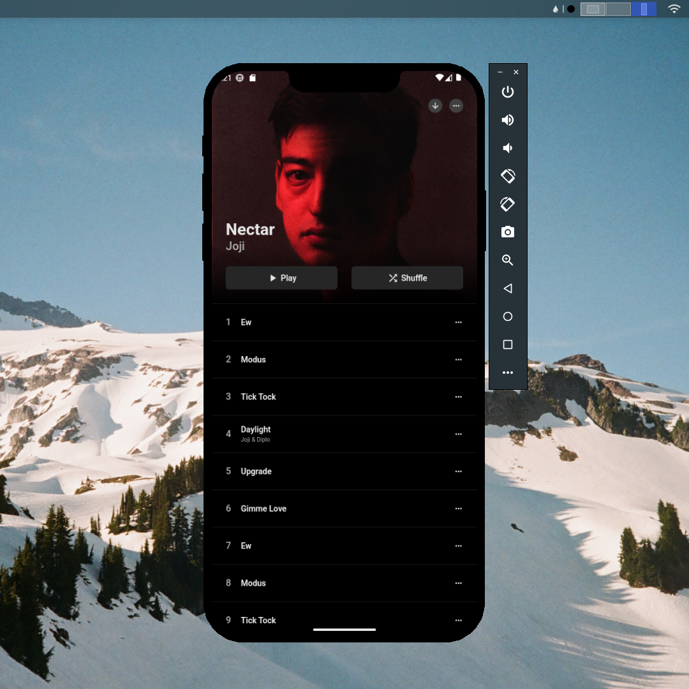

## Flutter UI - Album View

```dart
void main() => runApp(const MaterialApp(
      debugShowCheckedModeBanner: false,
      home: HomePage(),
    ));
```

Dribbble 
* [Album View by Adrian Spiegelt on Dribbble](https://dribbble.com/shots/17461178-Album-View)


## Development Setup
```
git clone https://github.com/afifcodes/flutter-album-view.git
cd flutter-album-view
flutter pub get
flutter run
```

## Screenshots


## Links

* [Website](https://afifcodes.vercel.app)
* [Youtube channel](https://youtube.com/developedbyafif)
* [Instagram](https://instagram.com/developedbyafif)
